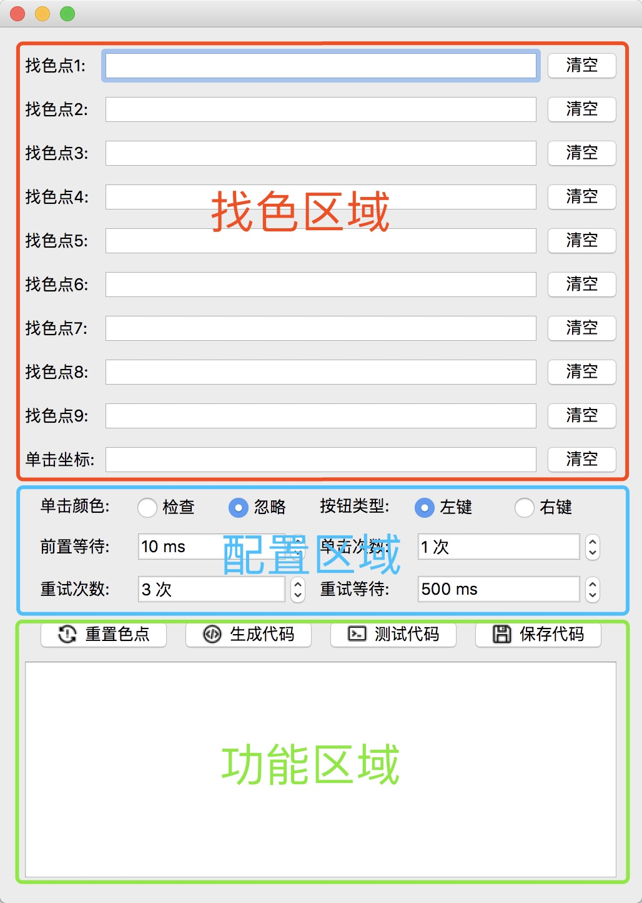

# FlyMouse
跨系统平台的一款`找色按键精灵`。

主要运行原理为：检测屏幕上一点或多点像素的颜色值(最多可以10个点)，如果颜色值全部符合，则用鼠标点击设定的点(或者执行其他命令)。
## 运行截图

下面将根据各个区域进行功能介绍。
## 找色区域

>找色点：需要检测的屏幕坐标以及该点的`RGB`值
>- 每个找`色点`对用快捷键`F1`~`F9`(注意：由于没有全局热键，这里需要在程序内才能使用)

>清空：清空对应找`色点`已经录入的信息

>单击坐标：需要点击的屏幕坐标以及该点的`RGB`值
>- 该点快捷键为`F10`(注意：由于没有全局热键，这里需要在程序内才能使用)
>- 该配置项与`配置区域`-`单击颜色`功能有关联设定，设置是否将该点的`RGB`值也作为检测`色点`，默认为忽略。
## 配置区域

>单击颜色：设置是否将单击坐标点的`RGB`值也作为检测`色点`，默认为忽略。

>按钮类型：设置点击鼠标`左键`或`右键`。

>前置等待：执行检测前的`等待时间`。

>单击次数：单击次数。

>重试次数：检测屏幕`色点`失败后是否需要重试，以及重试多少次的设定。

>重试等待: 重试前需要`等待时间`。
>- `重试等待`不包含`前置等待`，即`前置等待`配置只会在执行检测前执行一次sleep(int)。
## 功能区域

>重置色点：清空所有`色点`已经录入的信息。
>- 不包含`单击坐标`

>生成代码：将上方设定的`色点`、`单击坐标`，以及`配置区域`生成执行代码。
>- 代码会生成至下方的`代码编辑框`

>测试代码：执行`代码编辑框`中的代码。
>- 如果执行成功，`代码编辑框`字体会变成绿色，否则为红色。

>保存代码：将`代码编辑框`中的代码保存到sqlite数据库。
>- 该功能尚未开发。
## 执行区域
>- 该功能尚未开发。
>- 该区域有`重新执行`、`从此行开始执行`、`暂停`、`停止`功能。
>- 下方会有一个`QTableWidget`控件，显示已经添加到sqlite数据库的脚本代码。
>- 双击`QTableWidget`控件中的行，弹出修改信息窗体，可以手动修改`代码执行顺序`、`备注`、`是否启用`、`代码内容`等信息。
>- 另外`QTableWidget`控件中的行有`代码上移`、`代码下移`、`是否启用`、`删除代码`等按钮。
## 安装搭建
> 安装依赖库
>- pip install pyqt5==5.9
>- pip install pynput
>- pip install pyscreeze
>- pip install colorama
>- pip install sqlalchemy

>启动
>- python main.py
## 应用场景
- 一些需要重复工作的场景
- 抢红包(虽然，检测效率感人，但在Windows系统上可以有更快的速度)
- 制作游戏脚本
## 开发计划
- 增加`保存代码`功能
- 增加`执行区域`模块
- 增加`键盘操作`功能 可以参考`pynput`文档
- 增加往MouseControler.clicks(click_point_dict, **kwargs)传递一个函数参数, 从而在达到屏幕检测通过后执行其他命令，而非点击屏幕坐标。
## 各平台说明
> Windows: 未测试
>- Windows可以使用win32加快屏幕检测速度， 或者阅读`pyscreeze`中`pixel(x, y)`源码后对本程序进行修改。

> Linux: 未测试

> OS X: 已测试
>- 由于不能调用API，找了很多途径都没办法解决读取屏幕坐标颜色值，只能通过截图后通过PIL读取颜色值。
>- 执行一次屏幕检测需要耗时0.4~0.6秒。
## 联系作者
欢迎添加作者QQ进行交流。

QQ：442487605